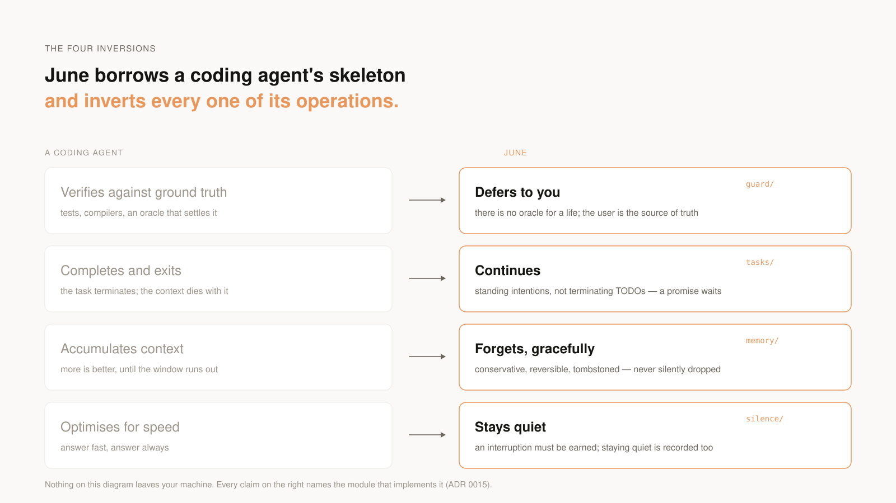
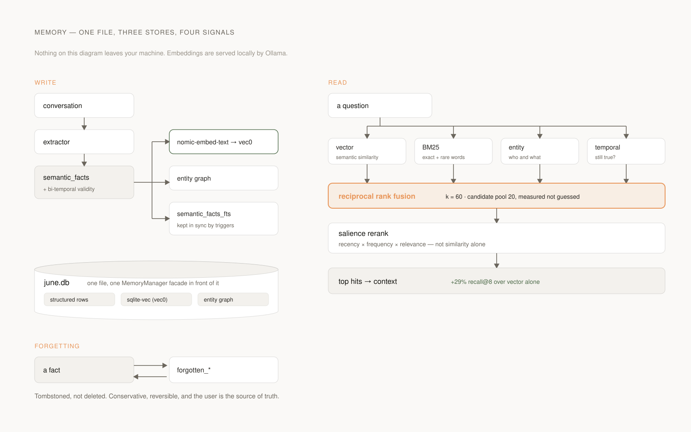
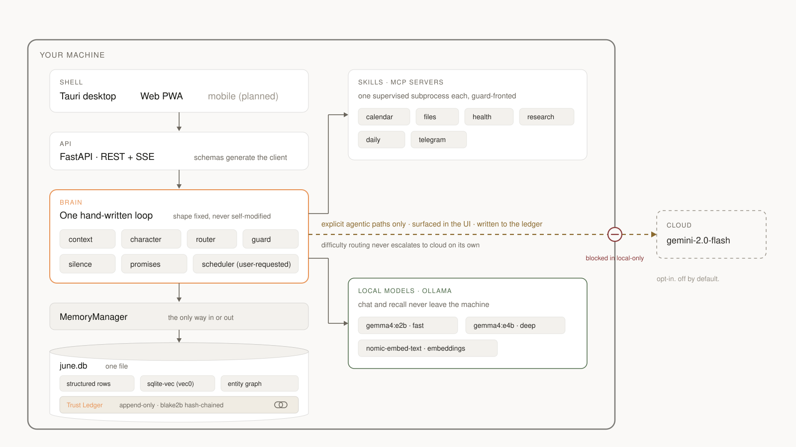
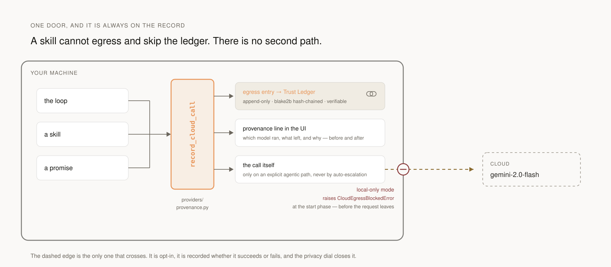

<p align="center">
  <picture>
    <source media="(prefers-color-scheme: dark)" srcset="assets/hero-dark.svg">
    
  </picture>
</p>

<p align="center">
  <a href="https://github.com/IrgenSlj/JuneAI/releases/latest"></a>
  <a href="https://github.com/IrgenSlj/JuneAI/actions/workflows/checks.yml"></a>
  <a href="LICENSE"></a>
  
</p>

---

June is a personal AI agent that runs on your machine, remembers what matters to
you, and does real work across your files and services — without an account and
without sending your data anywhere you didn't approve.

Chat and recall run locally on **Gemma 4** via [Ollama](https://ollama.com).
Agentic work reaches **Gemini** only when you allow it, and every cloud call is
visible in the UI before and after it happens. Your conversations, memories, and
embeddings live in a local SQLite database and an on-disk vector store. There is
no signup, no telemetry without consent, and one button to export everything.

> **Status:** June is alpha software under active development. It runs as a web
> app and as an Apple Silicon macOS app ([install below](#install-macos-apple-silicon)),
> ad-hoc signed rather than notarized, so macOS shows a first-launch warning. The
> **Tier 1 spine** of June's [vision](docs/vision.md) is
> built — portable data directory, model-specific provider layer, measured harness
> loop, layered context with anchored compaction, salience recall, an honest
> character, and a visible cloud boundary. Current focus: building June into a
> **trusted continuity engine**: home continuity, Promises, Memory governance,
> Trust, Skills permissions, and event-driven Time. See the
> [v0.4 development plan](docs/product/v0.4-development-plan.md) and
> [what is true right now](docs/CURRENT.md).

June's center of gravity is the user, not the task. It borrows a coding agent's
skeleton but inverts its four operations:

<picture>
  <source media="(prefers-color-scheme: dark)" srcset="docs/architecture/diagrams/four-inversions-dark.svg">
  
</picture>

## Why June

Most assistants ask you to trade privacy for capability. June is a bet that you
shouldn't have to. Five principles are enforced in code, not just promised:

- **No account needed.** June is installed, not subscribed to. No signup, no login, no
  cloud sync by default.
- **One automatic network call, and it is logged.** June checks for a new
  release at most once a day, so a security fix can reach you. It sends no user
  data, appears in Receipts like any other egress, is blocked by local-only
  mode, and can be turned off on its own ([ADR 0031](docs/decisions/0031-update-check-egress.md)).
  Nothing else leaves unless you ask for it.
- **No silent cloud calls.** Every cloud-routed model call and every external
  service call is surfaced in the UI. A privacy dial in settings can lock June
  to local-only.
- **No telemetry without consent.** Nothing leaves your device unless you opt in.
- **One brain, every surface.** Browser, desktop, and (planned) mobile share the
  same memory, the same agent, and the same UI build. No shell-specific business
  logic.
- **Your data is portable.** Export is one command; delete is one button.

## Highlights

On `main` today:

- **Memory that remembers what matters.** Three stores behind one `MemoryManager`
  — SQLite facts, a sqlite-vec semantic index, and an entity graph — all in one
  file. Recall fuses four signals and reranks by *salience* (recency × frequency ×
  relevance), not similarity alone: **+29% recall@8 over vector search alone**,
  [measured on a 100-case corpus](docs/product/retrieval-benchmark.md). Browse,
  search, edit, and forget anything at `/memory`.

<picture>
  <source media="(prefers-color-scheme: dark)" srcset="docs/architecture/diagrams/memory-architecture-dark.svg">
  
</picture>

- **A visible cloud boundary.** Every turn carries a provenance line — which model
  ran, whether anything left the device, and a plain-English rationale. A privacy
  dial can lock June to local-only, which provably blocks egress.
- **One honest voice.** June's character is a self-authored block with honesty and
  a behavioral safety floor as a fixed, non-editable core — personalization can
  shape tone, never erode candor into flattery.
- **Portable by design.** Everything June is lives under one documented, versioned
  data directory — copy the folder to move machines.
- **Promises, skills, and Trust.** Long-running promises keep blocked reason,
  next action, final deliverable, and a live SSE step trace; capabilities are
  standalone [MCP](https://modelcontextprotocol.io) servers, independently
  toggled; `/system` is the Trust surface with waiting work, runtime health,
  traces, and the activity log.

## What makes it different

Most local AI projects stop at "it runs on your machine." June's bet is that a
personal agent with memory needs a *trust layer* you can see:

- **Trust Ledger.** Every consequential action and every cloud egress is written
  to an append-only, hash-chained local log you can inspect and cryptographically
  verify from the Trust screen. Nothing June does is off the record.
- **Silence Model.** June speaks only when it's worth interrupting you. Every
  decision to surface — or to stay quiet — is itself recorded, so restraint is
  auditable too.
- **Graceful forgetting.** Forgetting is a first-class, conservative, reversible
  operation, with you as the source of truth. Auditable sleep-time consolidation
  (Night Shift) arrives in v0.2.
- **Provably local.** Loopback-only, no account needed, no telemetry by default. Every
  cloud call is surfaced before and after; a privacy dial can block egress entirely.

## Architecture

June is layered. Each layer calls only into the one below it.

<picture>
  <source media="(prefers-color-scheme: dark)" srcset="docs/architecture/diagrams/system-map-dark.svg">
  
</picture>

Every cloud call (the dashed edge) is surfaced in the UI and written to the Trust
Ledger before and after it happens; local-only mode blocks that edge entirely.

### The one door

<picture>
  <source media="(prefers-color-scheme: dark)" srcset="docs/architecture/diagrams/cloud-boundary-dark.svg">
  
</picture>

The chokepoint is a single function, so a skill cannot reach the network and skip
the record. In local-only mode it raises before the request leaves rather than
asking the caller to behave.

The **brain** is the intelligence and is usable on its own — a Python developer
can depend on `june-brain` and embed June without the HTTP layer. The **API** is
a deliberately thin FastAPI boundary that streams the compiled agent. The **UI**
is a single SvelteKit build that every shell wraps. See
[docs/architecture/overview.md](docs/architecture/overview.md) for the full
picture and [docs/decisions/](docs/decisions/) for the ADRs behind each choice.

## Install (macOS, Apple Silicon)

Download `June_0.1.0_aarch64.dmg` from the
[latest release](https://github.com/IrgenSlj/JuneAI/releases/latest), open it,
and drag June to Applications.

**First launch shows a security warning.** June is ad-hoc signed, not notarized
(Apple Developer enrollment is pending), so macOS refuses the first double-click.
Right-click June in Applications, choose **Open**, then **Open** again in the
dialog. You only do this once. If you would rather not, build from source with
the [quickstart](#quickstart) below — the DMG is the same code.

**June needs a local model runtime.** June does not bundle one, and there is no
cloud account to fall back on:

| What | Size | How |
| --- | --- | --- |
| [Ollama](https://ollama.com) | ~200 MB | Install it, or let June's setup screen open the download for you |
| `gemma4:e2b` (chat, local) | ~7.2 GB | June's three-step guide pulls it, or `ollama pull gemma4:e2b` |
| `nomic-embed-text` (memory) | ~275 MB | `ollama pull nomic-embed-text` |

Budget roughly **8 GB of disk** and a first-run download that takes as long as
your connection takes. The embedding model is small but not optional in
practice: without it June still chats and still remembers, but recall falls back
from semantic search to a keyword scan, and memory is the whole point. June's
setup screen tells you which of the three are missing and links to a guide that
installs each one.

A [Gemini API key](https://aistudio.google.com) is an alternative to Ollama for
chat, but it is a cloud provider — every call leaves your machine, is shown in
the UI before and after, and is written to the Trust Ledger.

The first launch after install takes 15-30 seconds while the frozen Python
sidecar warms up. Later launches take about two seconds.

## Use June's memory from Claude Desktop, Cursor, or any MCP client

You do not need the Mac app, and you do not need to download a model. June can
act as an [MCP](https://modelcontextprotocol.io) memory server for an assistant
you already run — and every read that assistant performs lands in June's
Receipts, which is the whole point.

**1. Install the brain** (Python 3.13):

```bash
pip install ./packages/brain    # from a clone; a published wheel is coming
```

**2. Point your client at it.** In Claude Desktop's `claude_desktop_config.json`:

```json
{
  "mcpServers": {
    "june-memory": {
      "command": "june-mcp",
      "env": { "JUNE_MCP_CLIENT": "claude-desktop" }
    }
  }
}
```

**3. Grant access.** Nothing is readable until you say so — the first call comes
back refused, telling you exactly what to run:

```bash
june-mcp grant claude-desktop search_memory   # or `all` for every read tool
june-mcp list                                  # what is allowed, and what it has read
june-mcp revoke claude-desktop                 # effective on the next call
```

**What the client can and cannot do.** Three read tools — `search_memory`,
`get_memory`, `list_recent`. There is no write, no forget, no update: a memory
store any connected agent can write is a poisoning vector. Every call, allowed or
refused, is written to the hash-chained Trust Ledger and appears under **External
reads** in `/system` → Receipts. The ledger records the shape of each access —
which tool, whose grant, how many facts came back — never the text of what was
read.

**One honest limitation.** `JUNE_MCP_CLIENT` is a name the client declares, not
an identity it proves; MCP has no client authentication. A grant narrows blast
radius and creates an audit trail — it does not stop another program on the same
machine from claiming the same name. Closing that needs OS-level attestation and
is tracked, not hidden. See [ADR 0030](docs/decisions/0030-june-as-mcp-memory-server.md).

## Quickstart

Running from source, for development or if you would rather not use the DMG.

**Prerequisites**

- Node.js 20+ with [`pnpm`](https://pnpm.io)
- Python 3.13
- One model provider:
  - [Ollama](https://ollama.com) with `gemma4:e2b` pulled (fully local; `run.sh` pulls it for you), **or**
  - a [Gemini API key](https://aistudio.google.com) (cloud)

**Install and verify**

```bash
git clone https://github.com/IrgenSlj/JuneAI.git
cd JuneAI
cp .env.example .env
./tools/bootstrap.sh   # creates packages/brain/.venv, installs Python + pnpm deps
./tools/check.sh       # backend tests, frontend checks, OpenAPI drift check
```

`bootstrap.sh` is idempotent and safe to re-run. `dev.sh` is a check-only script
(it verifies Ollama/Gemini readiness and runs the gate); it does not start the
app.

**Run the stack**

```bash
./tools/run.sh   # starts Ollama if needed, pulls the model, runs API + web; Ctrl-C stops all
```

Or run the pieces yourself in two terminals:

```bash
packages/brain/.venv/bin/june-api   # API
pnpm dev                            # web app
```

Open <http://localhost:5173>. First run walks you through choosing a provider and
verifying it with a single round-trip. From there:

| Route       | What it does                                                        |
| ----------- | ------------------------------------------------------------------- |
| `/`         | Chat plus a continuity summary of what June is holding              |
| `/tasks`    | Promises: standing work, waiting states, traces, deliverables       |
| `/memory`   | Browse, search, edit, and forget what June remembers                |
| `/skills`   | Toggle MCP skills, try tools in a playground, browse the registry   |
| `/system`   | Trust: waiting work, runtime status, traces, activity, degraded modes |
| `/settings` | Privacy dial, provider switch, Gemini key, theme                    |

## Model roster and hardware

June is tuned for a specific roster, not abstracted to be model-agnostic (ADR 0017):

| Role | Model | Runs on |
| --- | --- | --- |
| `local-fast` | `gemma4:e2b` (Ollama) | everyday chat, classification, recall synthesis |
| `local-deep` | `gemma4:e4b` (Ollama) | harder reasoning and creative work |
| `cloud-capable` | `gemini-2.0-flash` | opt-in only, for agentic work you explicitly allow |

Embeddings are served locally by Ollama (`nomic-embed-text`). The live chat path
routes between the two local tiers by difficulty and **never escalates to the
cloud on its own** — cloud is reached only on paths you opt into.

Rough guidance (Apple Silicon):

- **8 GB** — `local-fast` only. Fully usable for chat and memory; skip `local-deep`.
- **16 GB** — both local tiers comfortably. The recommended target.
- **32 GB+** — both tiers with headroom for larger local models and agentic work.

## Repository layout

```
JuneAI/
├── apps/
│   ├── web/          SvelteKit PWA — the primary shipped surface
│   └── desktop/      Tauri shell (in development)
├── packages/
│   ├── brain/        Python: provider layer, harness loop, context, memory, character, skills
│   ├── api/          Python: FastAPI surface (REST + SSE)
│   ├── ui/           Shared Svelte components + the generated typed API client
│   └── design/       Design tokens
├── skills/           MCP skill servers: calendar, health, research, files, daily
├── docs/             Vision, architecture, ADRs, product plans, setup guides
└── tools/            run.sh (launch), bootstrap.sh, check.sh, preflight.sh, codegen.sh
```

## Tech stack

- **Brain:** Python with a hand-written harness loop (one engine, no agent
  framework — see ADR 0018), three-store memory (one SQLite db: structured rows + a sqlite-vec vector index + a graph),
  and a model-specific provider layer (Gemma 4 + Gemini).
- **API:** [FastAPI](https://fastapi.tiangolo.com) with SSE streaming. Pydantic
  schemas are the single source of truth; the TypeScript client is generated
  from the OpenAPI spec.
- **UI:** [SvelteKit](https://svelte.dev) 5 (runes), installable PWA, light/dark.
- **Skills:** [Model Context Protocol](https://modelcontextprotocol.io) over
  stdio, one supervised subprocess per skill.
- **Shells:** [Tauri](https://tauri.app) (desktop), [Capacitor](https://capacitorjs.com)
  (mobile, planned).

## Development

The project gate is one command and is exactly what CI runs:

```bash
./tools/check.sh
```

It runs the backend test suite (`pytest`), the frontend type/lint checks
(`svelte-check`), and an OpenAPI codegen drift check that fails if the generated
TypeScript client is out of sync with the Pydantic schemas. CI runs the same gate
on Python 3.13 plus a frontend build.

When you change a Pydantic schema or an API route, regenerate the client:

```bash
./tools/codegen.sh
```

## Roadmap

The **Tier 1 spine** is built, and so are the trust primitives on top of it: the
Trust Ledger, the guard layer, the Silence Model, and multi-signal retrieval
(vector + BM25 + entity + temporal, fused with RRF). The active phase is
**v0.4** — correctness and coherence: one privacy predicate, one loop engine,
one tool surface, and the invariants turned into gate checks. See the current
state in [docs/CURRENT.md](docs/CURRENT.md), the plan in
[docs/product/v0.4-development-plan.md](docs/product/v0.4-development-plan.md)
and
[ROADMAP.md](ROADMAP.md).

## Security posture

June's threat model takes seriously that a personal agent with memory is a target
— including web-content prompt injection that tries to poison what June remembers.

- **What June never does:** no account needed, no cloud sync, no telemetry without
  explicit opt-in, no unlogged network calls, no timer-driven proactivity, and no
  self-modification of its own harness core.
- **Structural defenses:** untrusted fetched content is always framed as data;
  consequential and network actions are gated; secrets are redacted before they
  reach the ledger; the cloud tier never receives what you keep local.
- **Responsible disclosure:** see [SECURITY.md](SECURITY.md). Please report
  vulnerabilities privately before public disclosure.

## Contributing

Contributions are welcome. The bar for a change is simple: it keeps the
local-first privacy model understandable and does not make first-run setup harder
for a newcomer.

- Read [CONTRIBUTING.md](CONTRIBUTING.md) for setup and the PR checklist, and
  [SECURITY.md](SECURITY.md) for responsible disclosure.
- Good first contributions: a memory-browser improvement, a provider edge case, a
  salience-weight or character-shaping refinement, a small MCP skill, or anything
  on the [roadmap](ROADMAP.md).
- Keep PRs focused; add or update tests for behavior changes in `packages/brain`
  or `packages/api`; run `./tools/check.sh` before pushing.
- Any change that touches the privacy boundary must make cloud-mode behavior
  visible in the UI and the docs.

Discussion happens in [GitHub issues](https://github.com/IrgenSlj/JuneAI/issues).

## Documentation

- [Current state](docs/CURRENT.md) — the authoritative state-of-the-project page
- [v0.4 development plan](docs/product/v0.4-development-plan.md) — the single plan of record: state, phases, acceptance criteria
- [Vision](docs/vision.md) — what June is and the non-negotiables
- [Product overview](docs/product/overview.md) — the surfaces and the boundary
- [Architecture overview](docs/architecture/overview.md) — the layered model
- [Architecture Decision Records](docs/decisions/) — why the design is the way it is
- [Roadmap](docs/product/roadmap.md) — what ships next
- [Environment reference](docs/setup/environment.md) — configuration options

## License

[MIT](LICENSE).
