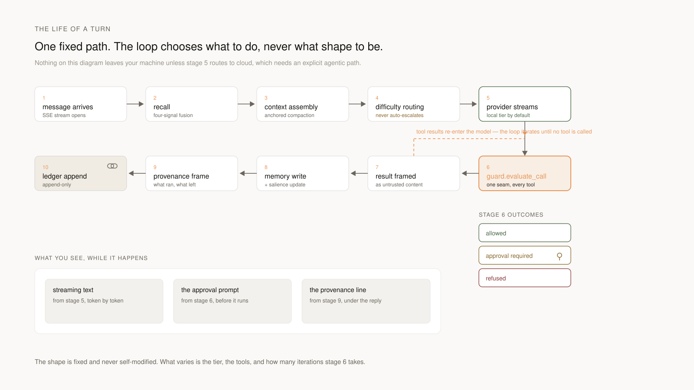
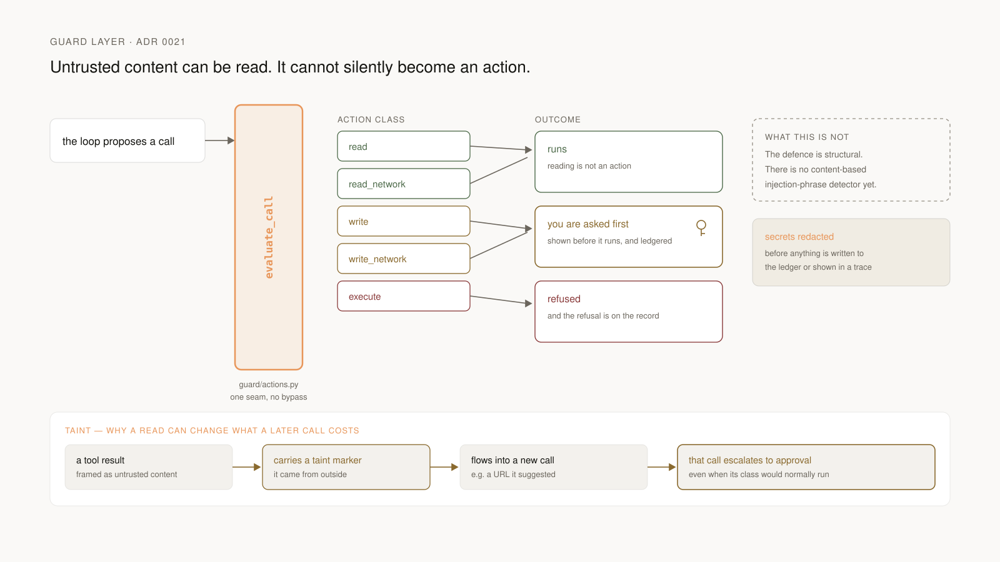
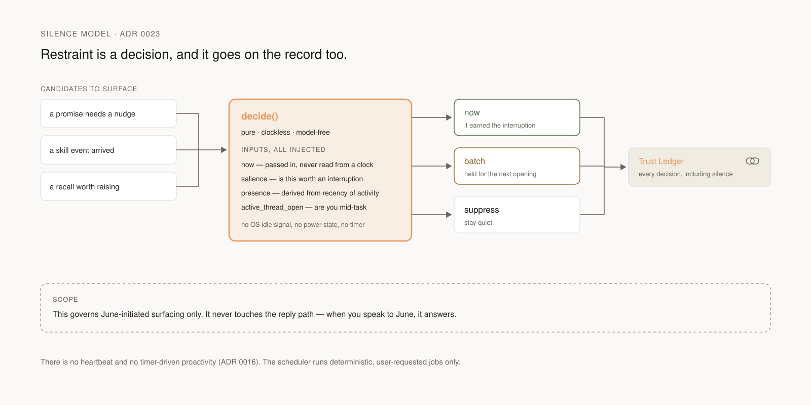
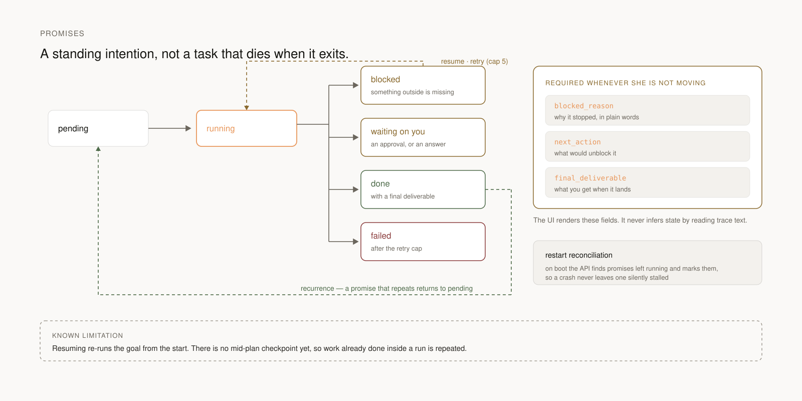
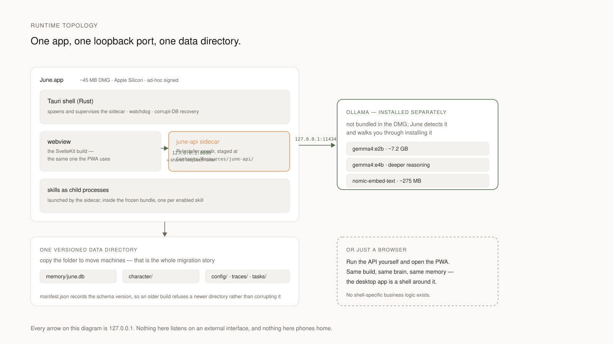

# Architecture Overview

This document describes how June is built and the harness shape it is being built
toward. For the rationale behind each choice, see the Architecture Decision Records
under `docs/decisions/`. For the authoritative, decision-by-decision plan, see
[rebuild-plan.md](../product/rebuild-plan.md).

The brain runs on a hand-written harness loop — the one engine (ADR 0018). The
Tier 1 spine introduced a model-specific provider layer, a fixed loop behind an
interface, layered context with anchored compaction, salience recall, an honest
character block, and a visible cloud boundary. The CLEAR experiment (C.2) chose
the hand-written loop; the LangGraph engine has since been removed. Sections
below mark what is shipped
versus in-progress.

## Diagrams

The nine diagrams in [`diagrams/`](diagrams/) are the fastest way into this
document. Each ships as a dark/light pair and is referenced from the section it
belongs to. Four of them (four inversions, system map, memory architecture, cloud
boundary) also appear on the [README](../../README.md); the other five are here.

| Diagram | What it settles |
| --- | --- |
| [system map](diagrams/system-map-dark.svg) | the layers, the one file, and the single edge that leaves |
| [four inversions](diagrams/four-inversions-dark.svg) | how June differs from a coding agent, module by module |
| [memory architecture](diagrams/memory-architecture-dark.svg) | write path, four-signal read path, and forgetting |
| [cloud boundary](diagrams/cloud-boundary-dark.svg) | the egress chokepoint and what it emits every time |
| [turn lifecycle](diagrams/turn-lifecycle-dark.svg) | the ten stages of a single message |
| [guard and taint](diagrams/guard-taint-dark.svg) | how untrusted content is stopped from becoming an action |
| [silence model](diagrams/silence-model-dark.svg) | how June decides whether to speak at all |
| [promise lifecycle](diagrams/promise-lifecycle-dark.svg) | the states of a standing intention, and its known limit |
| [runtime topology](diagrams/runtime-topology-dark.svg) | what actually runs on the machine, and on which port |

## Layered View

June is organized in horizontal layers, each with a single responsibility:

<picture>
  <source media="(prefers-color-scheme: dark)" srcset="diagrams/system-map-dark.svg">
  
</picture>


```
┌───────────────────────────────────────────────────────────────┐
│  SHELLS       Tauri (macOS)   Capacitor (iOS)   PWA (Web)     │
├───────────────────────────────────────────────────────────────┤
│  UI           SvelteKit app + shared TypeScript components    │
├───────────────────────────────────────────────────────────────┤
│  API          FastAPI · REST + SSE streaming (+ provenance)   │
├───────────────────────────────────────────────────────────────┤
│  BRAIN        loop · context · memory · character · router    │
├───────────────────────────────────────────────────────────────┤
│  PROVIDERS    local-fast / local-deep (Gemma 4)   cloud (Gemini)│
└───────────────────────────────────────────────────────────────┘
                              ↑
                    ┌─────────┴─────────┐
                    │  SKILLS (MCP)     │
                    │  calendar, health,│
                    │  research, files, │
                    │  daily, google*   │
                    └───────────────────┘
```

A layer only calls into the layer directly below it. Shells consume the UI; the UI
consumes the API; the API consumes the Brain; the Brain consumes the Providers and
the Skills. No layer reaches across another.

## The Data Directory

`<datadir>/` — one documented, versioned folder that *is* June (C.0 / ADR 0020).
Everything June persists lives here, so "move to a new machine" is "copy the
folder," and "reload" is "read the manifest and rehydrate."

```
<datadir>/
  manifest.json            # {schema_version, created_at, june_version, contents[]}
  memory/                  # one SQLite june.db: facts + sqlite-vec vectors + graph
  character/persona.json   # the character block
  skills/                  # installed skill configs
  tasks/                   # promise artifacts / future append-only ledger
  config/                  # providers.toml, privacy mode, salience weights, thresholds
```

A `layout.py` module is the single source of truth for all June paths; nothing
hardcodes a path elsewhere. A missing or corrupt manifest initializes a fresh data
dir and surfaces that in the UI rather than failing silently.

## The Providers

`packages/brain/june_brain/providers/` (Tier 1, in-progress) — June is
*model-specific*, not model-agnostic (ADR 0017). The roster is exactly two models
behind three roles, with a clean seam for a third.

- **`local-fast` / `local-deep`** — Gemma 4 configurations via Ollama (HTTP).
- **`cloud-capable`** — Gemini via the official Google client.

A `registry.py` maps roles to concrete models from `config/providers.toml`; the
brain references roles, config names models. All model access goes through a
provider — no raw model HTTP call lives anywhere else in the brain — and every
cloud call emits a provenance event before and after.

## The Brain

`packages/brain/` — Python, installable as `june-brain`. The brain is the
intelligence; anything model-facing or memory-facing lives here, and it is usable
without the API.

Harness modules (Tier 1 target shape):

- **`loop/`** — a fixed loop behind a `HarnessLoop` interface:
  `assemble_context → call_provider → (tool calls? dispatch → observe → repeat :
  done) → maybe_compact`. `handwritten.py` is the one implementation (ADR 0018).
  The loop never mutates its own structure — dynamic choices flow as data, not as
  new control-flow nodes.
- **`context/`** — `assembler.py` composes a fixed 5-part order (system/persona →
  character → pinned state → recalled memory → recent raw turns) so the stable
  prefix is cache-friendly. `pinned_state.py` is a small structured anchor (goal,
  constraints, confirmed facts, open questions). `compactor.py` triggers at a token
  threshold and *merges* summaries into the pinned state rather than regenerating,
  with a salience-drop fallback when the local model can't summarize reliably.
- **`memory/`** — three-store memory (ADR 0004): `sqlite.py`, `vector.py`,
  `graph.py`, with `manager.py` as the facade. `salience.py` ranks recall by
  `recency × frequency × relevance` instead of similarity alone; recalled rows have
  their `access_count` / `last_accessed` updated.
- **`character/`** — `block.py` holds a `CharacterBlock` with immutable
  `FixedTraits` (candor lives here) and editable `LearnedTraits`. `shaping.py` is a
  prompt section (not a second model call) that shapes register and warmth.
  A `character_update` tool may edit `learned` but hard-refuses any write to
  `fixed`.
- **`router/difficulty.py`** — a cheap `local-fast` classifier tagging each request
  `{trivial|standard|hard|creative}`, feeding tier selection.
- **`capability/probe.py`** — fixed micro-tasks scored against known-good answers,
  producing a `CapabilityProfile` ({good|weak|poor} per operation) the compaction
  and self-edit fallbacks read. Plumbed in Tier 1 and surfaced in Trust.
- **`tasks/`** — the promises primitive. A promise records goal, status, trace
  steps, blocked reason, next action, final deliverable, and recurrence metadata.
  Blocked work stays `awaiting_user` until the user changes policy or retries.

Shipped: the hand-written loop (`loop/`), the three-store memory, the model
provider layer, the MCP skills client, and pattern/context detection. The
LangGraph agent that the brain originally ran on has been removed, justified by
the CLEAR experiment (ADR 0018).

## The API

`packages/api/` — Python, FastAPI. The network boundary, deliberately thin: routes
wrap the brain, handle HTTP and SSE, and nothing else.

- **`POST /chat`** — stream an agent turn over SSE. Emits token, tool-call, memory,
  and **provenance** events. The provenance event (`TurnProvenance`) reports tiers
  used, whether a cloud call happened and what it sent, models, memories recalled,
  skills called, and a one-line rationale.
- **`GET /memory/{user_id}`**, **`POST`/`PATCH`/`DELETE` fact routes** — snapshot
  and edit across the three stores via `MemoryManager`.
- **`GET /skills`**, **toggle routes** — discovered skill servers and per-tool
  toggles.
- **`GET /system`** — Trust/runtime status: provider, privacy dial, Ollama health,
  semantic recall readiness, and build version.
- **`GET /tasks/{user_id}`** and related task routes — promises, waiting states,
  traces, blocked reason, next action, and deliverables.

Invariant: no cloud call without a provenance event; local-only mode blocks egress.
All schemas are Pydantic models; `tools/codegen.sh` produces the TypeScript types
under `packages/ui/src/api/types.ts`. The UI never defines its own API types.

The legacy Obsidian/Canvas export endpoint is superseded by the native on-demand
memory graph (D.6); it remains until the native graph lands.

## The UI

`apps/web/` + `packages/ui/` — TypeScript, SvelteKit. The shared frontend; every
shell serves the same build.

- **`packages/ui/`** — reusable components (`ChatBubble`, `MessageList`,
  `Composer`, `MemoryCard`, ...), stores, and the generated typed client.
- **`apps/web/`** — routes: `/` (chat plus continuity summary), `/memory`
  (browser + the native graph in Tier 2), `/tasks` (Promises), `/skills`,
  `/settings`, `/system` (Trust).
- **`packages/ui/src/platform/`** — a capability layer exposing `notify`,
  `registerHotkey`, `pickFile`, and Ollama supervision, with Tauri, Capacitor, and
  Web backends selected at load.

## The Shells

- **Web** — the SvelteKit PWA, installable via the browser. Shipped.
- **`apps/desktop/`** — Tauri 2.x: Ollama supervision (ADR 0008), tray, global
  hotkey, native notifications, autostart. Builds; produced the v0.1.0 DMG. Signing
  and the Python sidecar remain open.
- **`apps/mobile/`** — planned Capacitor shell, trigger-gated.

Shells contain no business logic; they expose capabilities the UI calls through the
platform layer.

## The Skills

`skills/` — one folder per skill, each a standalone MCP server (ADR 0005). The
brain's supervisor discovers skills from a manifest, spawns each as a child
process, and multiplexes tool calls over MCP stdio. A skill subprocess that
re-imports the brain is a fork bomb; the supervisor sets `JUNE_IS_SKILL_SUBPROCESS=1`
and `JUNE_SKILLS_DISABLED=1` in the child environment. Google services (Gmail,
Calendar, Drive, Maps) arrive in Tier 2 as per-service skills: granted once,
revocable, always visible, reads before writes.

## Data Flow: One Turn

<picture>
  <source media="(prefers-color-scheme: dark)" srcset="diagrams/turn-lifecycle-dark.svg">
  
</picture>

Every tool call in stage 6 passes the guard, which also tracks taint from one
call to the next:

<picture>
  <source media="(prefers-color-scheme: dark)" srcset="diagrams/guard-taint-dark.svg">
  
</picture>

June-initiated surfacing — never the reply path — goes through the Silence Model
instead:

<picture>
  <source media="(prefers-color-scheme: dark)" srcset="diagrams/silence-model-dark.svg">
  
</picture>

Work that outlives a single turn becomes a promise:

<picture>
  <source media="(prefers-color-scheme: dark)" srcset="diagrams/promise-lifecycle-dark.svg">
  
</picture>

And this is what is actually running while all of that happens:

<picture>
  <source media="(prefers-color-scheme: dark)" srcset="diagrams/runtime-topology-dark.svg">
  
</picture>

The same turn, as text:

```
user types a message in apps/web
        │
        ▼
SvelteKit composer → POST /chat (SSE) ──────────── @packages/api
        │
        ▼
difficulty classifier (local-fast) → router picks a tier
        │
        ▼
assembler builds context (fixed 5-part order) ──── @packages/brain
   1 system/persona  2 character  3 pinned state
   4 recalled memory (salience-ranked)  5 recent raw turns
        │
        ▼
loop calls provider (Gemma 4 local, or Gemini if allowed)
        │
        ├──► tool call? → MCP skill process → observe → repeat
        │
        ▼
near token threshold? → compact: summarize oldest turns,
                        MERGE into pinned state, drop raw turns
        │
        ▼
tokens stream back over SSE → SvelteKit renders
        │
        ▼
turn emits provenance (tiers, cloud y/n + payload summary,
                        memories recalled, skills, rationale)
        │
        ▼
post-turn: MemoryManager.extract → sqlite / sqlite-vec / graph
```

## Where User Data Lives

All of June lives under the portable data directory (C.0). The default location
resolves from config to an OS app-data path: `~/Library/Application Support/June/`
on macOS, `~/.local/share/June/` on Linux, `%APPDATA%/June/` on Windows; on iOS the
app's sandboxed container. Logs go to `~/Library/Logs/June/` on macOS. Secrets use
OS credential storage (Keychain / Credential Manager / libsecret). The repository
never contains user data.
